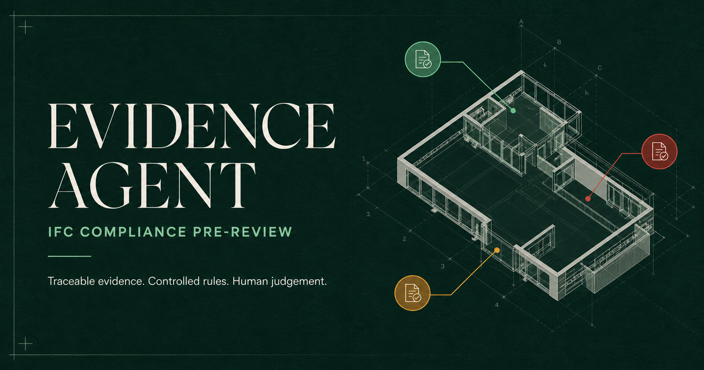

# Evidence Agent

[](https://evidence-agent-ifc-review.junnaifj.chatgpt.site)

**Live web application:** [Launch Evidence Agent](https://evidence-agent-ifc-review.junnaifj.chatgpt.site)

Evidence Agent is an evidence-first BIM compliance workspace for IFC pre-review. It combines a real browser-based IFC viewer, deterministic compliance rules, document-to-rule extraction, human approval, project memory, revision comparison and numerically guarded bilingual reports.

> The application supports professional pre-review. It does not certify statutory compliance or replace approved plans or a suitably qualified professional.

## Assessment path

The complete demonstration works without an API key:

1. Load the small, licensed **Duplex residence** sample or upload an IFC2x3/IFC4 file.
2. Orbit, pan and zoom the real IFC geometry; use X-ray and section controls.
3. Run two deterministic checks. Move the pointer over the model to keep every reviewed element status-coloured while unreviewed shells become transparent grey. The picker indexes every streamed IFC product, searches the complete ray and prefers reviewed semantic elements. Repeated clicks at one point cycle through occluded elements. A selection isolates one GlobalId and filters its findings; click empty space or press Escape to clear.
4. Propose a natural-language rule. The Agent checks feasibility and the active catalogue before asking whether to replace the existing rule, keep both with distinct scope, or cancel.
5. Upload a PDF, DOCX, XLSX, CSV, IDS, IFC, DXF or text rule source. The document workspace reports extraction status, page and character evidence, previews the original and keeps every extracted passage in one draft package. Edit each entry, mark it for execution, reference or exclusion, confirm it and finalise the complete package without needing a model.
6. Select a finding and record a human disposition independently from the read-only machine verdict. Correct structured evidence only with a named reviewer, provenance and reason; inspect the before/after impact, confirm it explicitly, rerun the affected checks and undo it if necessary. The source IFC is never overwritten.
7. Work with the Codex-style Evidence Agent in one continuous thread. Local deterministic mode needs no account. OpenAI mode uses either an operator-managed server secret or the user's session-only API key, with GPT-5.6 model selection, strict tools, grounded-output verification and a truthful local fallback. Every rule or evidence change remains a proposal until human confirmation.
8. Select the complete rule package for the model and run the review. Included rules remain visible in the execution log even when the IFC contains no applicable element. Switch packages to review the same model under a different source without silently merging catalogues.
9. Click a finding to locate its GlobalId in 3D. Then tell the in-app Report Agent—in ordinary English or Chinese—who will read the report and what it should cover. Choose status, rule, storey, selected element, summary or per-finding detail, and English, Chinese or paired bilingual output. Generate locally or ask OpenAI for a verified professional narrative; no prompt copying is required.

## Deterministic rules

| Rule | Evidence policy |
| --- | --- |
| `EGRESS-WIDTH-001` | Applies only where exit-door applicability is explicit. `Pset_DoorCommon.ClearWidth` may pass or fail; nominal `IfcDoor.OverallWidth` remains a proxy and therefore `REVIEW`. The 900 mm value is an assessment parameter, not a universal statutory threshold. |
| `INFO-001` | Checks door name, applicability, width provenance and fire-rating evidence for confirmed exits. Missing information is `REVIEW`, never an invented failure or pass. |

LLMs may explain, extract and suggest. They never own `PASS`, `FAIL`, `REVIEW` or `NOT_APPLICABLE`.

## Real assessment samples

The product contains no candidate benchmark section. Three open-source models cover fast interaction, performance and negative applicability:

- xeokit Duplex residence — Apache-2.0, 14 doors and 21 spaces.
- BSI (2020) Medical-Dental Test Files, buildingSMART International — CC BY 4.0, 254 doors and 269 spaces.
- buildingSMART PCERT Architecture — CC BY 4.0 IFC4 negative control.

See [`public/samples/manifest.json`](public/samples/manifest.json) for exact source URLs, licences, hashes and expected counts. CI verifies every redistributed byte.

## Manual upload fixtures

[`manual-test-files/`](manual-test-files/) contains a concise Apache-2.0 `IfcOpenHouse.ifc` fixture and attribution for manual model-upload testing. A Buildings Department BIM statutory-submission PDF can also be downloaded into the Git-ignored `manual-test-files/hk-official/` folder for private preview testing. Its official URL, local hash and non-redistribution treatment are recorded in the manual-fixture manifest.

## Rule sources and copyright

The Hong Kong Buildings Department and Development Bureau entries are official links. Their full documents are not copied into this public repository because government copyright terms restrict republication. Users may upload an authorised copy for private, in-browser preview and extraction.

Extracted clauses remain `DRAFT`. A source page, sheet or text segment is retained, and a user must approve any activation.

## Agent architecture

- Review Orchestrator — bounded plan and hand-offs.
- Model Intake — schema, units, entity and GlobalId evidence.
- Document Intelligence — private parsing and candidate-rule extraction.
- Rule Agent — conflict, plausibility, scope and unit checks.
- Deterministic Rule Engine — verdict authority.
- Evidence Verifier — identifier and numerical guardrail.
- Report Agent — converts natural language into an editable, human-confirmed brief and produces an evidence-bound English, Chinese or bilingual narrative. A copyable external-LLM package is available only as an advanced option.

Project memory is device-local, inspectable and erasable. It stores approved rules and decisions, never API keys, and cannot bypass approval. An optional user-supplied OpenAI key is held only in page memory, passes through a same-origin server proxy and is cleared by refresh, page close or the visible Clear key action. It is never written to project memory, browser storage, logs or traces. Only bounded structured findings and rules are sent to the model; raw IFC and rule-source files stay in the browser. The local path always remains available.

Human review is a separate audit layer. It records reviewer dispositions, notes and version history without rewriting machine outcomes. Evidence corrections are applied to an effective review model with source, reason, reviewer and timestamp; the uploaded IFC remains immutable.

## Development

Requires Node.js 22.13 or later.

```bash
npm ci
npm run dev
```

OpenAI is optional. Copy `.env.example` to `.env.local` to configure an operator-managed server key, or select **OpenAI → My session API key** in the Agent workspace to test with your own separately billed API account. Never paste a key into source code, Git, an issue or a chat message. See [`docs/DEPLOYMENT.md`](docs/DEPLOYMENT.md).

## Connect your own OpenAI API key

1. Sign in to the [OpenAI Platform API key page](https://platform.openai.com/api-keys). This is separate from a normal ChatGPT or Codex subscription.
2. Select the appropriate OpenAI project and choose **Create new secret key**. Use a dedicated, restricted key for this assessment where your account permits it.
3. Copy the secret immediately. OpenAI shows the full value only when it is created; if it is lost, revoke it and create a replacement.
4. In Evidence Agent, open **Agent**, select **OpenAI**, then **My session API key**. Paste the key into the masked field and choose **Test connection**.
5. Use **Clear key** when finished. The application keeps a BYOK value only in page memory and does not write it to project memory, browser storage, source files or the Agent trace.

API use is billed through the selected OpenAI Platform project. Do not paste a real key into GitHub, screenshots, email, issue trackers or chat messages.

Quality gates:

```bash
npm run quality
```

The command runs linting, strict type checking, a production build and the complete deterministic test suite. The same gate runs on every push and pull request.

Before a GitHub upload, run the stricter repository preflight:

```bash
npm run preupload
```

It repeats the production quality gate, rejects tracked quarantine or obsolete starter files, checks patch integrity and blocks credential-like text. `.project-trash/` is a local, recoverable quarantine and is never included in Git or deployment packages.

## Repository map

```text
app/                         Bilingual product interface
components/IfcViewer.tsx     Real web-ifc + Three.js evidence viewer
components/HumanReviewPanel.tsx Human disposition, evidence correction and undo workflow
components/CodexAgentWorkspace.tsx Continuous Agent thread and composer controls
lib/compliance.ts            IFC evidence, rules, conflicts, reports and guardrails
lib/human-review.ts          Human review records, correction previews and effective model
lib/document-intelligence.ts Rule-source parsing and official-source registry
lib/rule-packages.ts         Human-confirmed, selectable whole-source packages
lib/memory.ts                Device-local project and audit memory
lib/agent.ts                 Provider registry and transparent orchestration trace
lib/openai-agent.server.ts   Responses API tool loop and verified structured output
lib/agent-gateway.ts         Explicit operator/BYOK credentials and rate limits
app/api/agent/               Same-origin, no-store server API routes
lib/report-agent.ts          Natural-language report brief, routing and safeguards
lib/viewer-interaction.ts    Hover/selection state and GlobalId finding filters
public/samples/               Licensed real IFC assessment models
prompts/                      Public Agent contracts
tests/                        Boundary, sample, security, licence and hallucination tests
docs/                         Architecture, SSD and assessment evidence
```

## Licence

Application code is MIT licensed. External IFC models and web-ifc retain their own licences and attribution; see `licences/` and the sample manifest.
