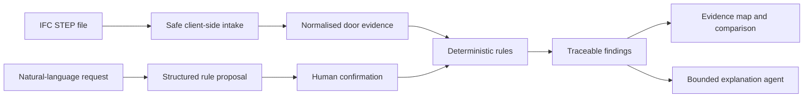

# Architecture

Evidence Agent deliberately separates numerical truth from language generation.

## Implemented assessment slice

- IFC2x3 and IFC4 STEP intake with explicit schema, storey and door inventory.
- Two built-in deterministic rules: exit-door clear-width evidence and door-information completeness.
- `PASS`, `FAIL`, `REVIEW` and `NOT_APPLICABLE` semantics.
- Reliability labels for explicit, proxy and missing evidence.
- Stable GlobalId-based model-version comparison.
- A controlled natural-language rule interpreter with an explicit confirmation gate.
- English and Chinese traceable Markdown reports.
- A local deterministic fallback, so the demonstration does not depend on an API key.

## Honest boundary

The browser prototype extracts a controlled evidence subset from IFC STEP text. Its evidence map is an abstract spatial index and is labelled as such; it does not pretend to reconstruct IFC geometry. Production geometry, property-set traversal and relationship resolution should use a vetted IFC runtime such as IfcOpenShell or web-ifc behind the same normalised contract.
