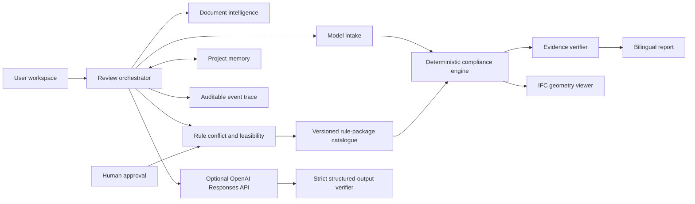

# Architecture

## Design principle

Evidence Agent separates semantic assistance from verdict authority. Agent output can create a draft, explanation or proposed scope. Only versioned deterministic code can create a compliance status, and only a human can activate or supersede a project rule.



## Evidence contract

The stable join key is IFC GlobalId. An element also retains its STEP express ID for geometry lookup. Every finding includes the rule ID and version, observed and required values, evidence path, reliability classification and next step.

Reliability states are `EXPLICIT`, `PROXY`, `MISSING` and `DERIVED`. A proxy cannot silently be promoted to explicit evidence.

## Viewer

The browser uses web-ifc WASM to stream IFC product meshes into Three.js. Geometry is not fabricated from parser counts. Picking, status colours and focus use the same GlobalId as the result list. Model bytes remain in the browser session.

## Rule lifecycle

```text
DRAFT → NEEDS_DECISION → VALIDATED → ACTIVE → SUPERSEDED
```

Conflict analysis distinguishes duplicate, stricter, looser and overlapping rules. Approval can replace the active rule, retain both with distinct scope, or cancel. Active records are preserved rather than overwritten.

### Rule-source package lifecycle

An uploaded source is processed independently of any model:

```text
SOURCE → EXTRACTED ENTRIES → HUMAN EDIT / INCLUDE / REFERENCE / EXCLUDE → READY PACKAGE
                                                                        ↓
MODEL ← SELECT ONE PACKAGE ← DETERMINISTIC EXECUTION ← ZERO-APPLICABILITY LOG
```

Every extracted passage remains in the draft package. Executable rules and reference-only requirements both require an explicit human decision; no extraction activates itself. A READY package is immutable evidence with source anchors, version and confirmation time. Choosing a different package changes the review method, clears stale findings and never merges one source silently into another. A rule with no matching model elements is still recorded as `NO_APPLICABLE_ELEMENTS`, rather than disappearing from the audit.

## Review and report contract

The review path follows a structured IFC pipeline: parse semantic properties and placements, evaluate versioned rules deterministically, join findings and geometry by IFC GlobalId, and expose a separate human disposition layer. Result selection and 3D selection are reciprocal.

The report path keeps the same source of truth but allows the user to select status, rule, storey, selected element, level of detail, audience and language. Local Markdown is always available. Optional AI generates professional narrative only; it receives bounded structured results, cannot alter verdicts and is rejected if its numbers, identifiers or statuses depart from the deterministic evidence.

## Memory and providers

Session context, approved project rules and audit decisions are separated. This assessment build stores project memory locally on the device and provides a clear action to erase it. Provider selection does not change deterministic findings. OpenAI may use an operator-managed server secret or a user-supplied session key. The session key is held only in component memory and is never persisted or recorded. Other provider connectors are labelled as planned and cannot be selected.

The OpenAI route sends bounded structured context—not IFC/PDF bytes—to the Responses API with `store: false`. A four-step maximum tool loop exposes only read and proposal tools. Strict Structured Outputs are parsed and then independently checked against current GlobalIds, verdicts, evidence paths and numerical allow-lists. A rejected or unavailable response is labelled and handled by the local deterministic fallback; it cannot change state.

The transparent trace shows plan, tool, decision and guardrail events. It does not expose or claim to expose hidden chain-of-thought.

## Copyright boundary

Hong Kong Government sources are registered by official URL and publisher. The public repository does not redistribute the full documents. An authorised local copy may be uploaded for private preview and candidate-rule extraction.
