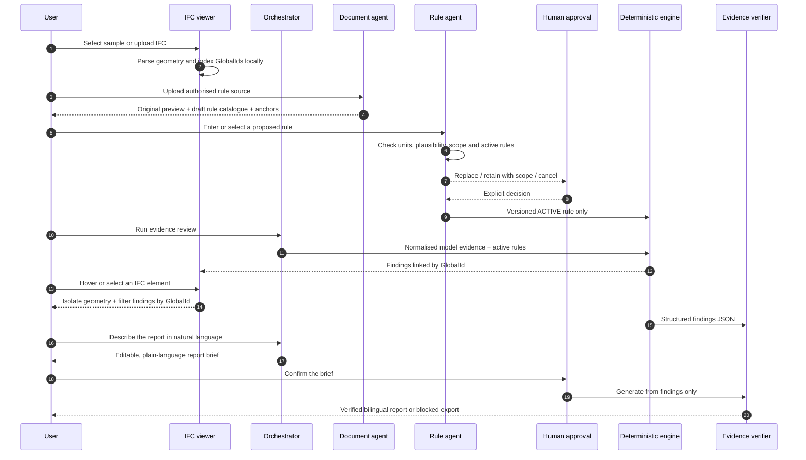

# System Sequence Design and Test Method · SSD v1.1

## Runtime SSD

## Quality gates

Every change runs, in order:

1. ESLint.
2. Strict TypeScript compilation.
3. Production build.
4. Boundary and unit tests.
5. Real IFC sample regressions.
6. Rule conflict and approval-state tests.
7. Document and prompt-injection tests.
8. Numerical and identifier hallucination mutation tests.
9. Licence, attribution and SHA-256 tests.
10. Server-render smoke tests.
11. Viewer interaction reducer and selected-GlobalId filter tests.
12. Report-intent routing, editable-brief and rule-change hand-off tests.
13. Browser diagnostics for hover, selection, blank-click/Escape clearing and reverse selection.

Deployment requires the complete `npm run quality` gate.

## Sensitive testing

- IFC, document and file-name text is untrusted and never executed.
- Prompt-injection prose cannot create an active rule.
- DWG is rejected with a truthful conversion requirement.
- Unsupported, disguised and malformed files fail closed.
- Project memory cannot activate a rule and exposes deletion.
- API credentials are not accepted in the browser.
- Unknown numerical claims and GlobalIds block report export.
- Report chat cannot alter an active rule, override a verdict or disclose credentials.
- Requests to change thresholds are handed to Rule Studio for conflict checking and human approval.
- Long, HTML-bearing and prompt-injection inputs are treated as untrusted text.
- Sample redistribution fails CI if source, licence, permission or hash is absent.

## Numerical hallucination method

The report verifier builds an allow-list from structured finding counts, thresholds, observations, derived deficits, trusted element names, evidence paths and identifiers. It normalises metre claims to millimetres. The report is then scanned for claims outside that allow-list.

Mutation tests alter `900 mm` to `990 mm`, replace a GlobalId, remove expected evidence, change REVIEW to PASS and invent summary totals. Each mutation must block export. Equivalent `0.9 m` and `900 mm` claims are normalised before comparison. Proxy dimensions can never be promoted to clear-width evidence. This guards invented values, changed verdicts and false certainty while permitting grounded dimensions already present in a model element name.

## Acceptance matrix

| Area | Acceptance |
| --- | --- |
| IFC | IFC2x3 Duplex and Clinic entity counts match; IFC4 negative control creates no invented doors |
| Rule boundary | 899 mm fails, 900 mm passes, 901 mm passes where clear width and applicability are explicit |
| Uncertainty | OverallWidth proxy and missing applicability remain `REVIEW` |
| Viewer | Real geometry loads; orbit, pan, zoom, X-ray and section operate. Hover dims non-targets; selection greys non-targets and filters findings; blank click/Escape clears; a findings-row click selects the model element. |
| Rule source | CSV sample previews and yields an anchored draft; no draft activates without a user choice |
| Bilingual | Navigation, workspaces, statuses, errors and report content change together |
| Report | Export is enabled only when numerical and identifier verification succeeds |
| Report Agent | Natural language becomes an editable brief; ordinary use requires no copied prompt; rule-change requests are routed to Rule Studio; deterministic local mode works without an API key |
| Licence | Three published IFC files match the manifest hashes and declared redistribution terms |
